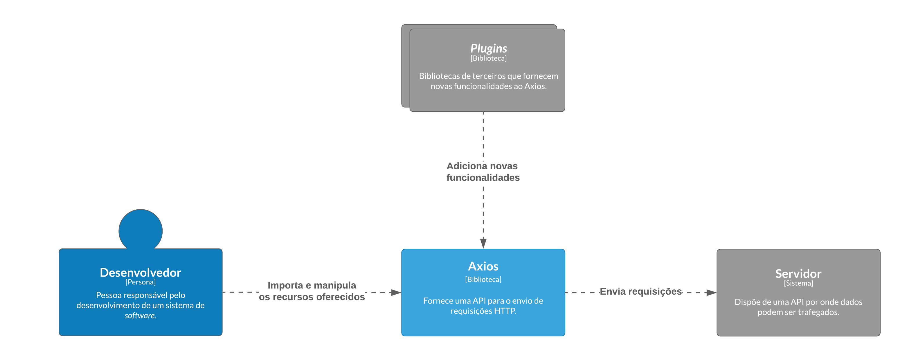
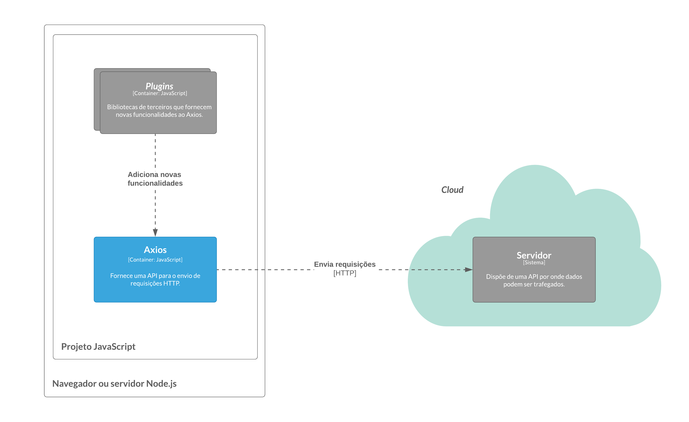
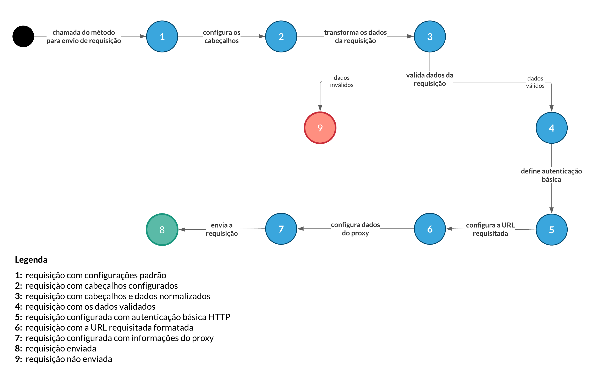

+++
title = "Documento Arquitetural do Axios"
date = "2020-10-12"
tags = []
categories = []
+++

# Autores

Este documento foi produzido por Marcus Vinícius de Farias Barbosa.

- Matrícula: 117110906
- Contato: marcus.barbosa@ccc.ufcg.edu.br
- Projeto documentado: https://github.com/axios/axios

# Descrição Arquitetural -- Axios

Este documento descreve a arquitetura do [Axios](https://github.com/axios/axios).
As descrições e diagramas aqui presentes foram produzidos usando como base o modelo [C4](https://c4model.com/).

## Descrição Geral

O Axios é um cliente HTTP, que pode ser utilizado tanto no navegador quando em projetos Node.js. Ele é disponibilizado 
como um pacote npm, e fornece uma API para o envio de requisições que lida com 
[XMLHttpRequest](https://developer.mozilla.org/en-US/docs/Web/API/XMLHttpRequest) do navegador e com o 
[http](https://nodejs.org/api/http.html) do Node.js, desse modo o mesmo código pode ser utilizado no lado cliente e no 
lado servidor.

De acordo com sua documentação oficial, o Axios conta com as seguintes funcionalidades:

- Faz requisições com XMLHttpRequest a partir do browser;
- Faz requisições http a partir do node.js;
- Tem suporte à API [Promise](https://developer.mozilla.org/en-US/docs/Web/JavaScript/Reference/Global_Objects/Promise);
- Intercepta requisições e respostas;
- Transforma dados de requisições e respostas;
- Cancela requisições;
- Faz transformações automáticas para dados JSON;
- Fornecer proteção no lado cliente contra [XSRF](https://pt.wikipedia.org/wiki/Cross-site_request_forgery).

Além disso, por ser uma biblioteca bastante conhecida e utilizada no meio do desenvolvimento web, existem diversas
bibliotecas criadas pela comunidade que interagem com o Axios e adicionam a ele novos recursos, que vão desde 
interceptores de requisições a cache.

Mais informações podem ser encontradas [aqui](https://github.com/axios/axios).

## Objetivos

Oferecer uma biblioteca baseada em Promises para envio de requisições HTTP de forma simples e sem que o usuário se
preocupe se a requisição será feita a partir do navegador ou de um servidor Node.js.

## Contexto

Como o Axios se trata de uma biblioteca, os usuários finais são os desenvolvedores de *software*, que a importam em seus
projetos e assim fazem uso de suas funcionalidades.

Em relação à comunicação com sistemas externos, a principal interação realizada é com o servidor alvo das requisições
definido pelo usuário. Esse servidor precisa dispor de uma API HTTP, pois esse é o protocolo de comunicação utilizado
pelo Axios em suas requisições.

A comunicação também é feita com *plugins* de terceiros, que são bibliotecas desenvolvidas para interagirem com os
recursos do Axios e adicionam a ele novas funcionalidades como suporte a *cookies*, manipulação de *cache* e
comunicação com *middlewares*. 

O diagrama de contexto abaixo ilustra quais entidades interagem com o Axios.

## *Containers*

Como o Axios não é um sistema de *software*, ou seja, não é composto por aplicações nem possui armazenamento de dados,
mas uma biblioteca, ele é constituído de um único *container* que possui todos os módulos de código necessários para
seu funcionamento e implementação de suas funcionalidades.

A sua implantação também é simples se comparado com sistemas de *software*, pois, tendo sido instalado no projeto
através de algum gerenciador de pacotes (como npm e yarn) ou pelo CDN, é preciso apenas se atentar para os requisitos de
ambiente: o navegador e sua versão, e a versão no Node.js. Como essas informações são voláteis e dependem da versão
atual do Axios, é recomendado verificá-las na [documentação](https://github.com/axios/axios) oficial.

O diagrama de implantação abaixo ilustra como é feita a implantação do Axios. Nele é possível notar que a biblioteca
pode ser utilizada tanto em aplicações que são executadas por um navegador quanto em aplicações Node.js em um servidor.
Além disso, nota-se também que os *plugins* utilizados estão no mesmo nível que o Axios e são importados e utilizados de
modo semelhante a ele.

## Componentes

O Axios é composto pelos seguintes componentes:

- **Axios**: fornece uma instância Axios com todos os métodos necessários configurados.
- ***Core***: contém a lógica de domínio do Axios. É nesse componente em que são implementados o gerenciador de 
  interceptadores, a manipulação de configurações e envio de requisições.
- ***Defaults***: define as configurações iniciais para a criação de uma instância Axios, como os *aliases* para os
  métodos de requisição e a definição do *adapter* adequado.
- ***Adapters***: responsável pelo envio de requisições e resolução de *Promises* retornadas assim que uma
  resposta é recebida. Existe um adapter para lidar com http do Node.js e outro para lidar com o XHR do navegador.
- ***Helpers***: dispõe de implementações genéricas que não são específicas para a lógica de domínio, mas que são
  utilizadas por toda a aplicação, como gerenciamento de *cookies*, *parsers* de cabeçalhos HTTP e *polyfills* do
  navegador.

O diagrama de componentes abaixo ilustra os componentes apresentados e sua comunicação.

## Visão de Informação

Dentre os vários tipos de dados que o Axios manipula, o que foi escolhido para ser apresentado nessa seção foi o dado que representa uma requisição, desde a chamada ao método de envio ao seu dispacho para o destinatário.

Através do seguinte fluxo de processamento de uma requisição é possível notar os estados que ela assume ao logo do processo:

  - O método para envio de uma requisição é chamado, e inicia-se o processo de configuração da requisição;
  - O Axios verifica a existência de cabeçalhos e os manipula, adicionando cabeçalhos necessários;
  - Os dados (cabeçalhos e informações enviadas no corpo) da requisição são transformados para um formato padrão;
  - É validado se esses dados são do tipo *string*, *ArrayBuffer*, *Buffer* ou *Stream*:
    - Se sim, a requisição continua sendo processada;
    - Se não, seu processo de envio é cancelado;
  - São definidos dados de autenticação básica HTTP na requisição;
  - O endereço (URL) do destinatário da requisição é formatado, bem como o protocolo utilizado;
  - Se foi definido algum *proxy*, a requisição recebe toda a configuração referente a ele, como porta, caminho e nome;
  - A requisição é então enviada.

O diagrama abaixo ilustra o que foi explanado acima, dando enfoque nos estados assumidos por uma requisição.

## Contribuições Concretas

Ainda não foram abertas PRs para o repositório oficial do Axios porque ainda é necessário validar a documentação já 
produzida e produzir uma versão em inglês.